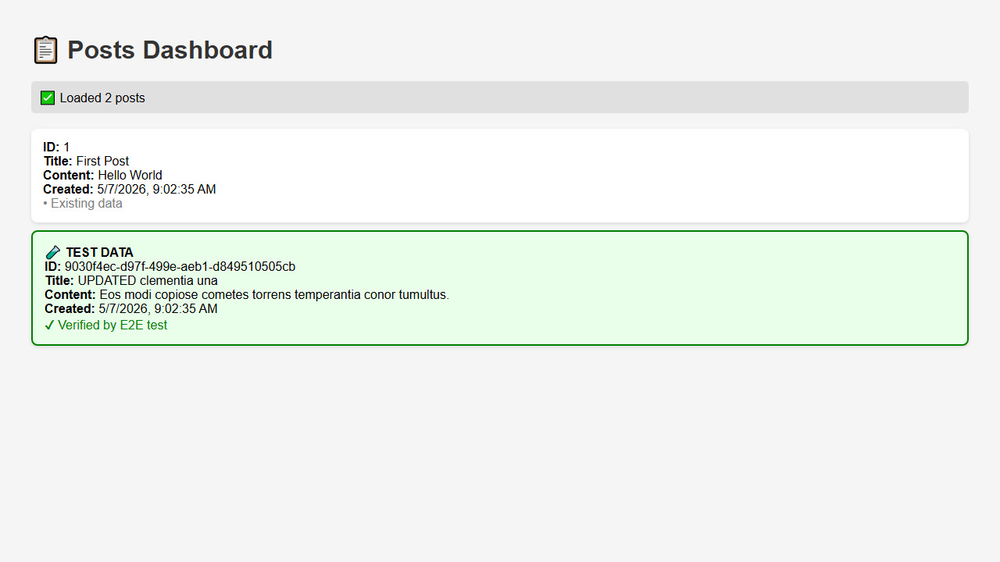
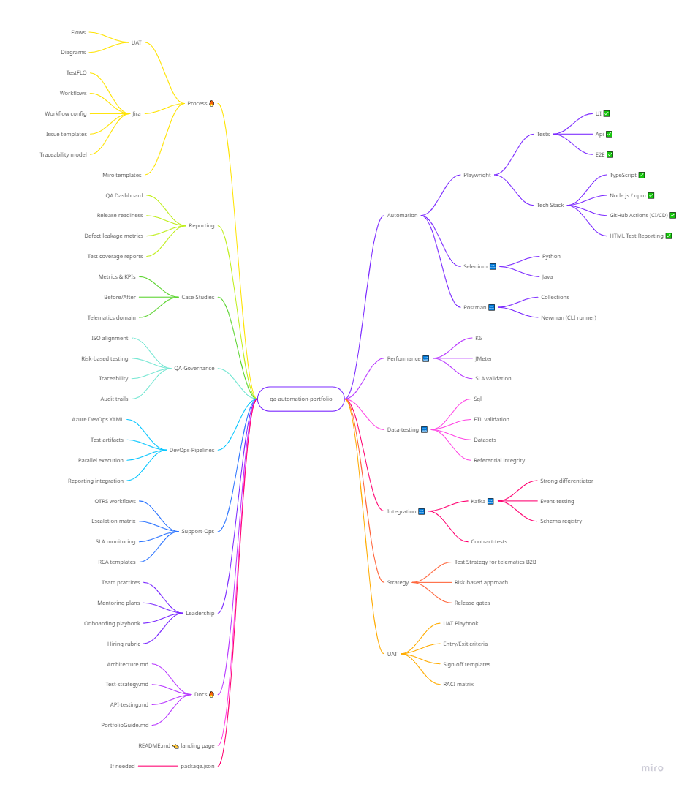

# QA Engineering Portfolio

## About Me

QA professional with 17+ years of experience in testing, currently focusing on:

- Test automation with Playwright
- Improving test coverage and efficiency
- Building scalable QA processes

This repository showcases my **hands-on work**, not just theory.

---

## Portfolio Overview

This portfolio is structured into multiple areas of QA engineering:

### Playwright Automation (UI + API + E2E)

🔗 [`automation/playwright`](./automation/playwright)

- UI automation (real user scenarios)
- API testing (auth, CRUD, validation)
- End-to-end flows (API → UI)
- CI/CD pipelines with GitHub Actions
- Public test reporting via GitHub Pages

This is currently the **main highlight project**

---

## E2E Flow Preview

Example of a full API → UI end-to-end validation flow:

The test:
- creates data via API
- validates it in the UI
- updates the data
- verifies UI synchronization
- deletes the entity
- confirms removal in the UI

---

## What This Portfolio Demonstrates

- Real-world QA mindset (not just automation scripts)
- Clean and scalable test architecture
- API + UI + E2E integration
- CI/CD knowledge and implementation
- Practical problem-solving (test stability, data handling)

---

## Tech Stack

- **Playwright**
- **TypeScript**
- **Node.js**
- GitHub Actions (**CI/CD**)
- REST APIs
- Mock services (Express.js)

---

## Current Focus

- Increasing automated test coverage
- Improving E2E reliability
- Designing maintainable test architecture
- Strengthening API testing skills

---

## Future Direction

This portfolio will expand with:

- API testing (advanced scenarios, contract testing)
- Test strategy & test planning examples
- Bug reports and real-world QA documentation
- Performance / load testing
- Test data management strategies

---

## Portfolio Roadmap

This portfolio is continuously evolving.

It reflects not only what I know today, but how I approach learning, problem-solving, and building quality into software.

This roadmap represents the planned evolution of the portfolio across multiple QA engineering areas.

---

## Contact

- LinkedIn: https://www.linkedin.com/in/attila-l%C5%91rincz-b10624255/

---