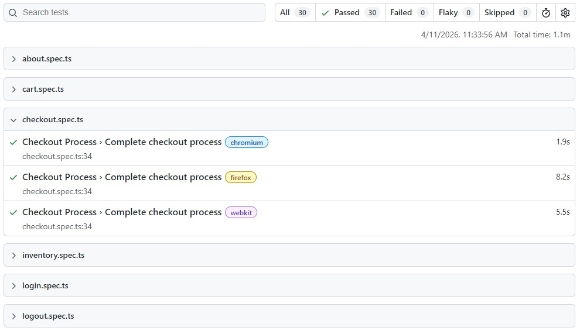

# QA Playwright Portfolio

## 🔎 Live Test Execution Dashboard

**Check the latest automated test results here:**

🔗 [](https://LAttila-17.github.io/qa-engineering-portfolio/)

*This live dashboard is automatically updated daily via GitHub Actions and published using GitHub Pages.*

---

## 🧪 CI/CD pipelines

### Test Execution (on push)

🔗 [](https://github.com/LAttila-17/qa-engineering-portfolio/actions/workflows/playwright.yml)

*Runs automated Playwright tests on every push and pull request*


### Scheduled Report Publishing (daily)

🔗 [](https://github.com/LAttila-17/qa-engineering-portfolio/actions/workflows/playwright-report.yml)

*Runs nightly and publishes the latest test report to GitHub Pages*

---

## Test Results & Reporting

- Playwright HTML reports generated after each run
- Detailed test results including steps, errors, and traces

### Live Report (Recommended)

View the latest report online:

🔗 https://LAttila-17.github.io/qa-engineering-portfolio/

- **Automatically updated daily**
- Publicly accessible
- **No download** required

### View in CI (GitHub Actions)

- Go to the **Actions** tab in this repository
- Open the latest workflow run
- Download the **playwright-report** artifact

---

## Overview

This project is a QA Automation portfolio built with Playwright and TypeScript, showcasing:

- End-to-end testing of real-world scenarios
- API testing and backend validation
- UI automation with realistic user flows
- CI/CD integration with automated pipelines
- Public test reporting via GitHub Pages

---

## Tech Stack

 


- **Playwright**
- **TypeScript**
- **Node.js / npm**
- GitHub Actions (**CI/CD**)
- HTML **test reporting**
- **Mock API** (Express.js)

---

## Test Coverage

This portfolio includes **UI, API, and full E2E scenarios**:

### UI Testing ###

- Login functionality (valid / invalid cases)
- Product inventory validation
- Add to cart and cart state persistence
- Checkout process (form validation and completion)
- Error handling and validation messages 

### API Testing ###
- Authentication (login, token handling)
- CRUD operations on posts
- Response validation (status codes, payload structure)
- Negative scenarios (invalid token, missing data)

### End-to-End (API → UI) ###
- Create data via API → verify in UI
- Update data via API → verify UI sync
- Delete data via API → verify removal in UI
- Full flow validation across system layers

---

## Test Architecture

- **Page Object Model** (POM) design pattern
- **API client** layer (auth, posts)
- **Separation** of test logic, API calls, UI interactions
- **Reusable** utilities (API context, data generation)
- **Scalable** structure

---

## E2E Strategy (Key Highlight)

Core strengths of this portfolio:
- Combines **API + UI testing in a single flow**
- Uses API for **fast and reliable test data setup**
- Uses UI for **real user validation**
- Avoids flaky UI-only setups
- Demonstrates **real-world QA approach**

Example flow:

*API → Create → UI Verify → API Update → UI Verify → API Delete → UI Verify*


## CI/CD Highlights

- **Separate workflows** for test execution and report publishing
  - **Automated** test execution **on every push**
  - **Scheduled** nightly test runs
- **Continuous validation** of test stability
- **Parallel execution** enabled
- HTML **report generation**
- Public **report hosting** via GitHub Pages
- Test **artifacts** available after pipeline runs

---

## Run Tests Manually

You can trigger a test run manually:

🔗 https://github.com/LAttila-17/qa-engineering-portfolio/actions/workflows/playwright-report.yml

Steps:
1. Click **Run workflow**
2. Start execution
3. View results in GitHub Actions or in the live dashboard

---

## Run Locally (Optional)

```bash
npm install
npx playwright install
npx playwright test
```

To view the HTML report:

```bash
npx playwright show-report
```

---

## Report Preview



---


## Future Improvements

- Advanced API validation (schema validation)
- Test data isolation strategies for parallel runs
- Contract testing (API layer)
- More complex E2E scenarios
- Performance / load testing integration